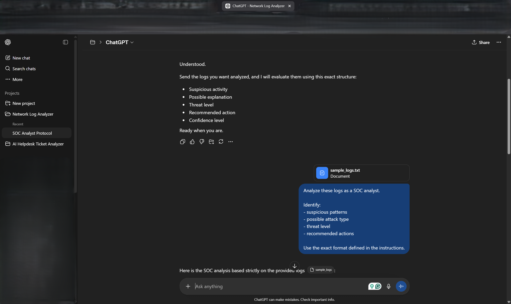
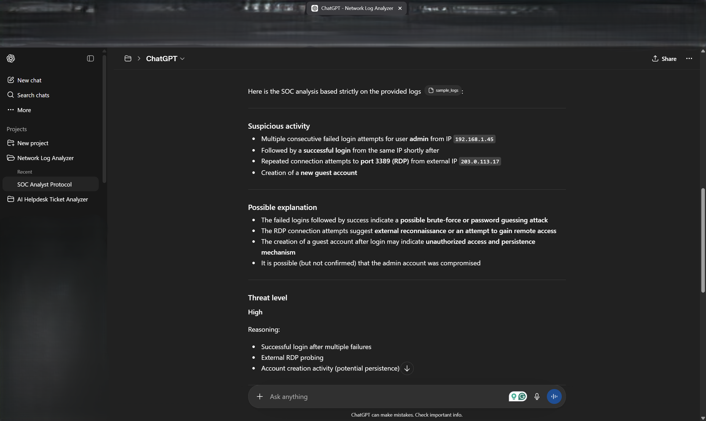
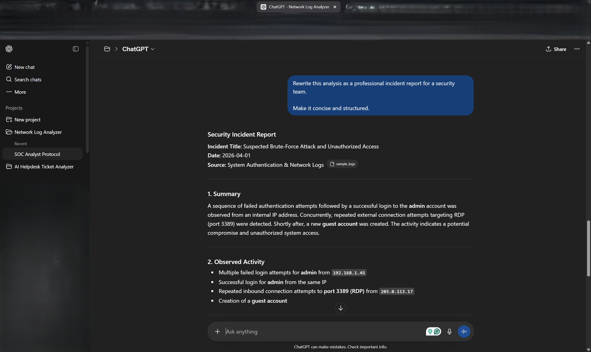

# Network Log Analyzer

## 📌 Project Overview
This project demonstrates how AI (ChatGPT) can be used to analyze network logs and detect potential security threats.

It transforms raw log data into structured security insights:
- Suspicious activity
- Threat explanation
- Threat level
- Recommended actions
- Confidence assessment

---

## ⚙️ Workflow
1. Input raw logs
2. Analyze using structured prompt
3. Identify suspicious patterns
4. Generate SOC-style analysis
5. Produce incident report

---

## 📂 Project Structure
- prompts/ → AI instructions
- data/ → raw logs
- outputs/ → analysis results
- screenshots/ → workflow proof
- docs/ → project documentation

---

## 📸 Screenshots

### Logs Input

### Analysis Output

### Incident Report

---

> Full analysis and documentation available in the /docs folder.

---

## 🛠 Tools Used
- ChatGPT (AI analysis)
- Google Docs

---

## 🚀 Skills Demonstrated
- Log analysis
- Threat detection
- Security reasoning
- Incident reporting
- AI-assisted cybersecurity workflows

---

## 📈 Result
This project shows how AI can assist in identifying suspicious activity and improving efficiency in security analysis workflows.

---

## 👤 Author
**Wassim Abelghouch**  
Aspiring IT / Cybersecurity professional building practical portfolio projects with AI-assisted workflows.
